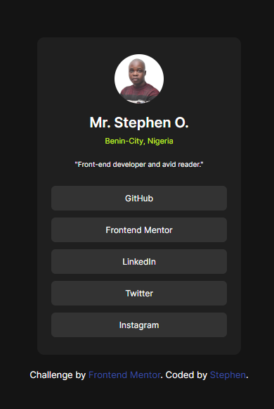

## Welcome! 👋

Thanks for checking out this front-end coding challenge.

# Frontend Mentor - Social links profile challenge

This is a solution to the Social links profile challenge on Frontend Mentor. Frontend Mentor challenges help you improve your coding skills by building realistic projects.

## Table of contents

- [Overview](#overview)
  - [The challenge](#the-challenge)
  - [Screenshot](#screenshot)
  - [Links](#links)
- [My process](#my-process)
  - [Built with](#built-with)
  - [What I learned](#what-i-learned)
  - [Continued development](#continued-development)
- [Author](#author)

## Overview

### The challenge

The challenge is to build a Social links profile and make it look as close to the design provided by Frontend Mentor as possible. Users should be able to view the optimal layout for the component depending on their device's screen size.

### Screenshot

### Links

- Solution URL: (https://github.com/xaintobas/social-links-profile)
- Live Site URL: (https://xaintobas.github.io/social-links-profile/)

## My process

### Built with

- Semantic HTML5 markup
- CSS custom properties
- Flexbox
- Mobile-first workflow

**Note: These are just examples. Delete this note and replace the list above with your own choices**

### What I learned

During this project, I enhanced my understanding of CSS Grid and Flexbox. I learned how to effectively create responsive layouts that adapt to various screen sizes. Additionally, I improved my skills in writing clean and maintainable CSS.

### Continued development

In future projects, I plan to continue improving my CSS Grid and Flexbox skills. I also aim to explore more advanced CSS techniques and animations to enhance user experience. Additionally, I would like to dive deeper into JavaScript to add interactivity to my projects.

## Author

- Frontend Mentor - https://www.frontendmentor.io/profile/xaintobas
- Twitter - https://x.com/xaint_obas
